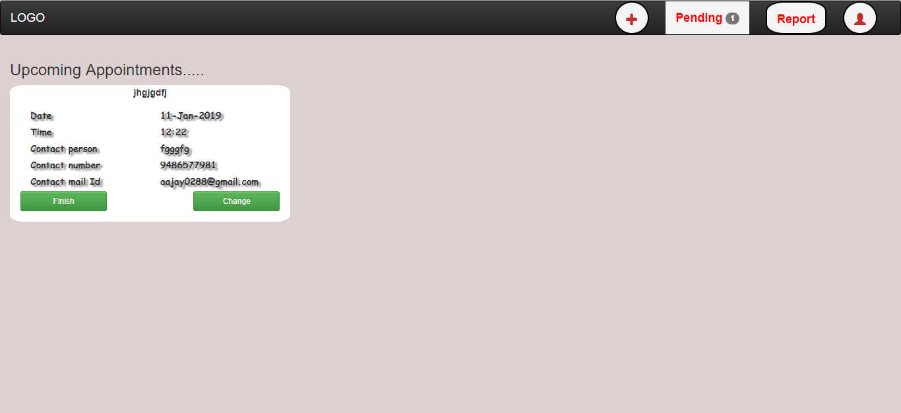
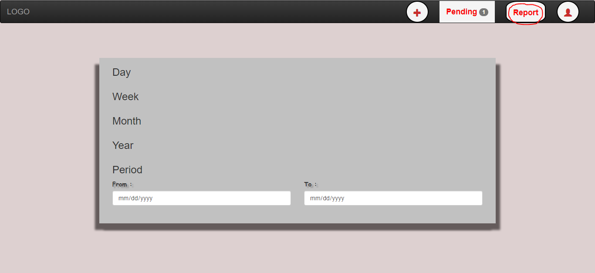

# SPTManager

Hello! Geeky patners I am Ajay UI/UX Web Developer Enthusiast. Very Happy to visit My repository. This is a blueprint(frontend)
of a real world project which specifies <b>Student Placement Tracking</b>. In most of the time the placement co-ordinators often
visits company for a date for the placement interview. The real world problem is the placement head doesn't know whether the company
visit the campus or reject the campus . This Project fully explains the solution for the explained problem.

In this project I have used <b>HTML</b> , <b>CSS</b>, <b>BOOTSTRAP</b>, <b>JAVASCRIPT</b> as well as <b>JQUERY</b>. The project
explains about the post-meeting , pre-meeting and record maintanance. The dynamic content is also added by JQUERY using event delegation

### Test Link
<a href="https://ajaykce.github.io/taskmanager">Click Here</a>

## ScreenShot

